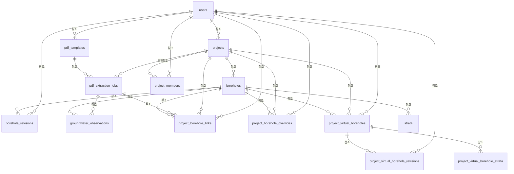

# GeoBIM DB Wiki — 자동 생성 스키마

> 이 파일은 `backend/scripts/generate_db_wiki.py`가 생성합니다. 직접 수정하지 마세요.
> 업무 의미와 계산 규칙은 [SEMANTICS.md](./SEMANTICS.md)에 기록합니다.

- 원본: `backend/app/models/__init__.py:Base.metadata`
- 테이블 수: 14
- 좌표 저장 기준: `boreholes.location`은 항상 WGS84(EPSG:4326)
- 삭제 기준: `deleted_at IS NULL`인 행만 활성 데이터

## 관계도

## 테이블 목록

- [`borehole_revisions`](#borehole-revisions) — 시추공 수정 이력
- [`boreholes`](#boreholes) — 시추공 위치·표고·원본 출처
- [`groundwater_observations`](#groundwater-observations) — 시추공별 지하수위 관측 이력과 추출 계보
- [`pdf_extraction_jobs`](#pdf-extraction-jobs) — PDF·CSV 추출 및 저장 작업 이력
- [`pdf_templates`](#pdf-templates) — PDF 영역 추출 템플릿
- [`project_borehole_links`](#project-borehole-links) — 프로젝트와 시추공의 역할·등록 작업 연결
- [`project_borehole_overrides`](#project-borehole-overrides) — 공공 원본을 보존하면서 프로젝트별로 적용하는 수정안
- [`project_members`](#project-members) — 프로젝트별 사용자 권한
- [`project_virtual_borehole_revisions`](#project-virtual-borehole-revisions) — 가상 시추공 수정 이력
- [`project_virtual_borehole_strata`](#project-virtual-borehole-strata) — 가상 시추공의 지층 구간
- [`project_virtual_boreholes`](#project-virtual-boreholes) — 프로젝트에서 생성한 가상 시추공
- [`projects`](#projects) — 시추 데이터 작업 단위와 지도 선택 영역
- [`strata`](#strata) — 시추공별 심도 구간과 지층 분류
- [`users`](#users) — 서비스 사용자와 전역 권한

## `borehole_revisions`

시추공 수정 이력

| 컬럼 | 타입 | NULL | PK | FK | 기본값 | 설명 |
|---|---|---:|---:|---|---|---|
| `id` | `BIGINT` | N | Y |  |  |  |
| `borehole_id` | `BIGINT` | N | N | `boreholes.id` |  |  |
| `version` | `INTEGER` | N | N |  |  |  |
| `payload` | `JSON` | N | N |  | `dict` |  |
| `reason` | `TEXT` | N | N |  |  |  |
| `edited_by_id` | `BIGINT` | Y | N | `users.id` |  |  |
| `restored_from` | `INTEGER` | Y | N |  |  |  |
| `created_at` | `DATETIME` | N | N |  | `now()` |  |
| `updated_at` | `DATETIME` | N | N |  | `now()` |  |
| `deleted_at` | `DATETIME` | Y | N |  |  |  |

인덱스:
- `ix_borehole_revisions_borehole_id`: `borehole_id`

## `boreholes`

시추공 위치·표고·원본 출처

| 컬럼 | 타입 | NULL | PK | FK | 기본값 | 설명 |
|---|---|---:|---:|---|---|---|
| `id` | `BIGINT` | N | Y |  |  |  |
| `project_id` | `BIGINT` | N | N | `projects.id` |  |  |
| `name` | `VARCHAR(100)` | N | N |  |  |  |
| `location` | `geography(POINT,4326)` | N | N |  |  | WGS84 경도·위도 PostGIS POINT (SRID 4326) |
| `elevation` | `FLOAT` | Y | N |  |  | 해수면 기준 시추공 표고(m) |
| `source_crs` | `VARCHAR(20)` | Y | N |  |  | 원본 평면좌표계 EPSG 코드 |
| `source_file` | `VARCHAR(500)` | Y | N |  |  | 원본 파일 또는 추출 작업의 파일 경로 |
| `is_supplementary` | `BOOLEAN` | N | N |  | `False` | 프로젝트 생성 후 추가 등록된 자료 여부 |
| `data_origin` | `VARCHAR(30)` | N | N |  | `public` | public, user_upload, manual_input, test |
| `created_at` | `DATETIME` | N | N |  | `now()` |  |
| `updated_at` | `DATETIME` | N | N |  | `now()` |  |
| `deleted_at` | `DATETIME` | Y | N |  |  |  |

인덱스:
- `idx_boreholes_location`: `location`
- `ix_boreholes_data_origin`: `data_origin`
- `ix_boreholes_name`: `name`
- `ix_boreholes_project_id`: `project_id`

## `groundwater_observations`

시추공별 지하수위 관측 이력과 추출 계보

| 컬럼 | 타입 | NULL | PK | FK | 기본값 | 설명 |
|---|---|---:|---:|---|---|---|
| `id` | `BIGINT` | N | Y |  |  |  |
| `borehole_id` | `BIGINT` | N | N | `boreholes.id` |  |  |
| `extraction_job_id` | `BIGINT` | Y | N | `pdf_extraction_jobs.id` |  |  |
| `observation_key` | `VARCHAR(200)` | N | N |  |  | 업로드 재시도 중복 방지용 관측 고유키 |
| `depth_bgl_m` | `FLOAT` | Y | N |  |  | 지표면(GL) 아래 지하수위 깊이(m, 아래 방향 양수) |
| `head_elevation_m` | `FLOAT` | Y | N |  |  | 해수면(EL) 기준 지하수 수두 표고(m) |
| `observed_at` | `DATETIME` | Y | N |  |  |  |
| `reference_datum` | `VARCHAR(10)` | N | N |  |  | 원본 기준면: GL, EL 또는 GL+EL |
| `raw_value` | `FLOAT` | Y | N |  |  |  |
| `raw_text` | `TEXT` | Y | N |  |  |  |
| `source_kind` | `VARCHAR(30)` | N | N |  | `pdf` | pdf, csv, legacy_raw_text |
| `source_page` | `INTEGER` | Y | N |  |  |  |
| `source_bbox` | `JSON` | Y | N |  |  |  |
| `confidence` | `FLOAT` | Y | N |  |  |  |
| `review_status` | `VARCHAR(30)` | N | N |  | `auto` | auto, confirmed, needs_review, rejected |
| `created_at` | `DATETIME` | N | N |  | `now()` |  |
| `updated_at` | `DATETIME` | N | N |  | `now()` |  |
| `deleted_at` | `DATETIME` | Y | N |  |  |  |

인덱스:
- `ix_groundwater_observations_borehole_id`: `borehole_id`
- `ix_groundwater_observations_extraction_job_id`: `extraction_job_id`
- `ix_groundwater_observations_review_status`: `review_status`

고유 제약:
- `observation_key`

## `pdf_extraction_jobs`

PDF·CSV 추출 및 저장 작업 이력

| 컬럼 | 타입 | NULL | PK | FK | 기본값 | 설명 |
|---|---|---:|---:|---|---|---|
| `id` | `BIGINT` | N | Y |  |  |  |
| `project_id` | `BIGINT` | N | N | `projects.id` |  |  |
| `file_path` | `VARCHAR(500)` | N | N |  |  |  |
| `status` | `VARCHAR(15)` | N | N |  | `ExtractionJobStatus.PENDING` |  |
| `template_id` | `BIGINT` | Y | N | `pdf_templates.id` |  |  |
| `result` | `JSON` | Y | N |  |  | 추출 매핑·이슈·저장 결과 JSON |
| `error` | `TEXT` | Y | N |  |  |  |
| `celery_task_id` | `VARCHAR(100)` | Y | N |  |  |  |
| `is_supplementary` | `BOOLEAN` | N | N |  | `False` | 기존 프로젝트에 신규 자료로 추가하는 작업 여부 |
| `created_at` | `DATETIME` | N | N |  | `now()` |  |
| `updated_at` | `DATETIME` | N | N |  | `now()` |  |
| `deleted_at` | `DATETIME` | Y | N |  |  |  |

인덱스:
- `ix_pdf_extraction_jobs_project_id`: `project_id`
- `ix_pdf_extraction_jobs_status`: `status`
- `ix_pdf_extraction_jobs_template_id`: `template_id`

## `pdf_templates`

PDF 영역 추출 템플릿

| 컬럼 | 타입 | NULL | PK | FK | 기본값 | 설명 |
|---|---|---:|---:|---|---|---|
| `id` | `BIGINT` | N | Y |  |  |  |
| `name` | `VARCHAR(200)` | N | N |  |  |  |
| `owner_id` | `BIGINT` | N | N | `users.id` |  |  |
| `region` | `VARCHAR(100)` | Y | N |  |  |  |
| `box_definitions` | `JSON` | N | N |  | `dict` |  |
| `match_keywords` | `JSON` | Y | N |  |  |  |
| `sample_pdf` | `VARCHAR(500)` | Y | N |  |  |  |
| `created_at` | `DATETIME` | N | N |  | `now()` |  |
| `updated_at` | `DATETIME` | N | N |  | `now()` |  |
| `deleted_at` | `DATETIME` | Y | N |  |  |  |

인덱스:
- `ix_pdf_templates_name`: `name`
- `ix_pdf_templates_owner_id`: `owner_id`
- `ix_pdf_templates_region`: `region`

## `project_borehole_links`

프로젝트와 시추공의 역할·등록 작업 연결

| 컬럼 | 타입 | NULL | PK | FK | 기본값 | 설명 |
|---|---|---:|---:|---|---|---|
| `id` | `BIGINT` | N | Y |  |  |  |
| `project_id` | `BIGINT` | N | N | `projects.id` |  |  |
| `borehole_id` | `BIGINT` | N | N | `boreholes.id` |  |  |
| `project_role` | `VARCHAR(30)` | N | N |  | `existing` | existing, new, duplicate_linked, excluded |
| `linked_reason` | `VARCHAR(50)` | N | N |  | `migrated` |  |
| `registered_from_job_id` | `BIGINT` | Y | N | `pdf_extraction_jobs.id` |  | 시추공을 등록한 추출 작업 |
| `registered_by_id` | `BIGINT` | Y | N | `users.id` |  |  |
| `created_at` | `DATETIME` | N | N |  | `now()` |  |
| `updated_at` | `DATETIME` | N | N |  | `now()` |  |
| `deleted_at` | `DATETIME` | Y | N |  |  |  |

인덱스:
- `ix_project_borehole_links_borehole_id`: `borehole_id`
- `ix_project_borehole_links_linked_reason`: `linked_reason`
- `ix_project_borehole_links_project_id`: `project_id`
- `ix_project_borehole_links_project_role`: `project_role`
- `ix_project_borehole_links_registered_from_job_id`: `registered_from_job_id`

## `project_borehole_overrides`

공공 원본을 보존하면서 프로젝트별로 적용하는 수정안

| 컬럼 | 타입 | NULL | PK | FK | 기본값 | 설명 |
|---|---|---:|---:|---|---|---|
| `id` | `BIGINT` | N | Y |  |  |  |
| `project_id` | `BIGINT` | N | N | `projects.id` |  |  |
| `source_borehole_id` | `BIGINT` | N | N | `boreholes.id` |  |  |
| `status` | `VARCHAR(30)` | N | N |  | `draft` |  |
| `data` | `JSON` | N | N |  | `dict` |  |
| `submitted_at` | `DATETIME` | Y | N |  |  |  |
| `approved_at` | `DATETIME` | Y | N |  |  |  |
| `approved_by_id` | `BIGINT` | Y | N | `users.id` |  |  |
| `created_at` | `DATETIME` | N | N |  | `now()` |  |
| `updated_at` | `DATETIME` | N | N |  | `now()` |  |
| `deleted_at` | `DATETIME` | Y | N |  |  |  |

인덱스:
- `ix_project_borehole_overrides_project_id`: `project_id`
- `ix_project_borehole_overrides_source_borehole_id`: `source_borehole_id`
- `ix_project_borehole_overrides_status`: `status`

## `project_members`

프로젝트별 사용자 권한

| 컬럼 | 타입 | NULL | PK | FK | 기본값 | 설명 |
|---|---|---:|---:|---|---|---|
| `project_id` | `BIGINT` | N | Y | `projects.id` |  |  |
| `user_id` | `BIGINT` | N | Y | `users.id` |  |  |
| `role` | `VARCHAR(6)` | N | N |  | `ProjectMemberRole.VIEWER` |  |
| `created_at` | `DATETIME` | N | N |  | `now()` |  |
| `updated_at` | `DATETIME` | N | N |  | `now()` |  |
| `deleted_at` | `DATETIME` | Y | N |  |  |  |

## `project_virtual_borehole_revisions`

가상 시추공 수정 이력

| 컬럼 | 타입 | NULL | PK | FK | 기본값 | 설명 |
|---|---|---:|---:|---|---|---|
| `id` | `BIGINT` | N | Y |  |  |  |
| `virtual_borehole_id` | `BIGINT` | N | N | `project_virtual_boreholes.id` |  |  |
| `version` | `INTEGER` | N | N |  |  |  |
| `snapshot` | `JSON` | N | N |  |  |  |
| `change_reason` | `TEXT` | N | N |  |  |  |
| `changed_by_id` | `BIGINT` | Y | N | `users.id` |  |  |
| `created_at` | `DATETIME` | N | N |  | `now()` |  |
| `updated_at` | `DATETIME` | N | N |  | `now()` |  |
| `deleted_at` | `DATETIME` | Y | N |  |  |  |

인덱스:
- `ix_project_virtual_borehole_revisions_virtual_borehole_id`: `virtual_borehole_id`

## `project_virtual_borehole_strata`

가상 시추공의 지층 구간

| 컬럼 | 타입 | NULL | PK | FK | 기본값 | 설명 |
|---|---|---:|---:|---|---|---|
| `id` | `BIGINT` | N | Y |  |  |  |
| `virtual_borehole_id` | `BIGINT` | N | N | `project_virtual_boreholes.id` |  |  |
| `sequence` | `INTEGER` | N | N |  |  |  |
| `depth_top` | `FLOAT` | N | N |  |  |  |
| `depth_bottom` | `FLOAT` | N | N |  |  |  |
| `soil_type` | `VARCHAR(50)` | N | N |  |  |  |
| `strata_group` | `VARCHAR(30)` | N | N |  |  |  |
| `confidence` | `VARCHAR(20)` | N | N |  | `medium` |  |
| `note` | `TEXT` | Y | N |  |  |  |
| `created_at` | `DATETIME` | N | N |  | `now()` |  |
| `updated_at` | `DATETIME` | N | N |  | `now()` |  |
| `deleted_at` | `DATETIME` | Y | N |  |  |  |

인덱스:
- `ix_project_virtual_borehole_strata_soil_type`: `soil_type`
- `ix_project_virtual_borehole_strata_strata_group`: `strata_group`
- `ix_project_virtual_borehole_strata_virtual_borehole_id`: `virtual_borehole_id`

## `project_virtual_boreholes`

프로젝트에서 생성한 가상 시추공

| 컬럼 | 타입 | NULL | PK | FK | 기본값 | 설명 |
|---|---|---:|---:|---|---|---|
| `id` | `BIGINT` | N | Y |  |  |  |
| `project_id` | `BIGINT` | N | N | `projects.id` |  |  |
| `name` | `VARCHAR(100)` | N | N |  |  |  |
| `location` | `geography(POINT,4326)` | N | N |  |  |  |
| `elevation` | `FLOAT` | N | N |  |  |  |
| `total_depth` | `FLOAT` | N | N |  |  |  |
| `source_borehole_id` | `BIGINT` | Y | N | `boreholes.id` |  |  |
| `source_snapshot` | `JSON` | Y | N |  |  |  |
| `status` | `VARCHAR(20)` | N | N |  | `draft` |  |
| `model_enabled` | `BOOLEAN` | N | N |  | `False` |  |
| `constraint_mode` | `VARCHAR(20)` | N | N |  | `hard` |  |
| `influence_weight` | `FLOAT` | N | N |  | `1.0` |  |
| `influence_radius_m` | `FLOAT` | Y | N |  |  |  |
| `purpose` | `VARCHAR(200)` | Y | N |  |  |  |
| `interpretation_note` | `TEXT` | N | N |  |  |  |
| `version` | `INTEGER` | N | N |  | `1` |  |
| `created_by_id` | `BIGINT` | Y | N | `users.id` |  |  |
| `created_at` | `DATETIME` | N | N |  | `now()` |  |
| `updated_at` | `DATETIME` | N | N |  | `now()` |  |
| `deleted_at` | `DATETIME` | Y | N |  |  |  |

인덱스:
- `idx_project_virtual_boreholes_location`: `location`
- `ix_project_virtual_boreholes_model_enabled`: `model_enabled`
- `ix_project_virtual_boreholes_name`: `name`
- `ix_project_virtual_boreholes_project_id`: `project_id`
- `ix_project_virtual_boreholes_source_borehole_id`: `source_borehole_id`
- `ix_project_virtual_boreholes_status`: `status`

## `projects`

시추 데이터 작업 단위와 지도 선택 영역

| 컬럼 | 타입 | NULL | PK | FK | 기본값 | 설명 |
|---|---|---:|---:|---|---|---|
| `id` | `BIGINT` | N | Y |  |  |  |
| `name` | `VARCHAR(200)` | N | N |  |  |  |
| `description` | `TEXT` | Y | N |  |  |  |
| `owner_id` | `BIGINT` | N | N | `users.id` |  |  |
| `region` | `VARCHAR(100)` | Y | N |  |  |  |
| `source_crs` | `VARCHAR(20)` | Y | N |  |  |  |
| `bbox` | `JSON` | Y | N |  |  |  |
| `created_at` | `DATETIME` | N | N |  | `now()` |  |
| `updated_at` | `DATETIME` | N | N |  | `now()` |  |
| `deleted_at` | `DATETIME` | Y | N |  |  |  |

인덱스:
- `ix_projects_name`: `name`
- `ix_projects_owner_id`: `owner_id`
- `ix_projects_region`: `region`

## `strata`

시추공별 심도 구간과 지층 분류

| 컬럼 | 타입 | NULL | PK | FK | 기본값 | 설명 |
|---|---|---:|---:|---|---|---|
| `id` | `BIGINT` | N | Y |  |  |  |
| `borehole_id` | `BIGINT` | N | N | `boreholes.id` |  |  |
| `depth_top` | `FLOAT` | N | N |  |  | 지표면(GL) 기준 지층 상단 심도(m, 아래 방향 양수) |
| `depth_bottom` | `FLOAT` | N | N |  |  | 지표면(GL) 기준 지층 하단 심도(m, 아래 방향 양수) |
| `soil_type` | `VARCHAR(50)` | N | N |  |  | 추출된 지층명 |
| `raw_text` | `TEXT` | Y | N |  |  | 원본 추출 행과 레거시 메타데이터 보존 문자열 |
| `n_value` | `FLOAT` | Y | N |  |  |  |
| `uscs_code` | `VARCHAR(20)` | Y | N |  |  |  |
| `source_file` | `VARCHAR(500)` | Y | N |  |  |  |
| `created_at` | `DATETIME` | N | N |  | `now()` |  |
| `updated_at` | `DATETIME` | N | N |  | `now()` |  |
| `deleted_at` | `DATETIME` | Y | N |  |  |  |

인덱스:
- `ix_strata_borehole_id`: `borehole_id`
- `ix_strata_soil_type`: `soil_type`

## `users`

서비스 사용자와 전역 권한

| 컬럼 | 타입 | NULL | PK | FK | 기본값 | 설명 |
|---|---|---:|---:|---|---|---|
| `id` | `BIGINT` | N | Y |  |  |  |
| `email` | `VARCHAR(255)` | N | N |  |  |  |
| `hashed_password` | `VARCHAR(255)` | N | N |  |  |  |
| `role` | `VARCHAR(8)` | N | N |  | `UserRole.DESIGNER` |  |
| `full_name` | `VARCHAR(100)` | Y | N |  |  |  |
| `is_active` | `BOOLEAN` | N | N |  | `True` |  |
| `created_at` | `DATETIME` | N | N |  | `now()` |  |
| `updated_at` | `DATETIME` | N | N |  | `now()` |  |
| `deleted_at` | `DATETIME` | Y | N |  |  |  |

인덱스:
- `ix_users_email` UNIQUE: `email`
